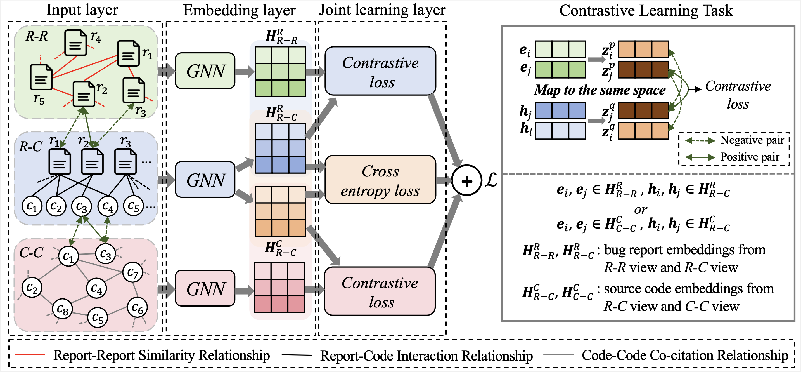

# MACL-IRFL

This repository contains the code for the paper **"Multi-View Adaptive Contrastive Learning for Information Retrieval Based Fault Localization"**.

## Overview


> We propose a novel approach named Multi-View Adaptive Contrastive Learning for Information Retrieval Fault Localization (MACL-IRFL) to learn the above-mentioned relationships for software fault localization. Specifically, we first generate data augmentations from report-code interaction view, report-report similarity view and code-code co-citation view separately, and adopt graph neural network to aggregate the information of bug reports or source code files from the three views in the embedding process. Moreover, we perform contrastive learning across these views. Our design of contrastive learning task will force the bug report representations to encode information shared by report-report and report-code views, and the source code file representations shared by code-code and report-code views, thereby alleviating the noise from auxiliary information.

## Usage

### Data Processing

The scripts located at the **process** directory are primarily for data processing tasks, including data cleaning, relation extraction, and graph construction.

```bash
python process/pipeline.py
```

### Model Training

```
python run.py
```

## Requirements

```
python 3.8.10
pandas==2.0.1
scipy==1.10.1
torch==2.0.1
networkx==3.1
numpy==1.24.3
tqdm==4.65.0
```

